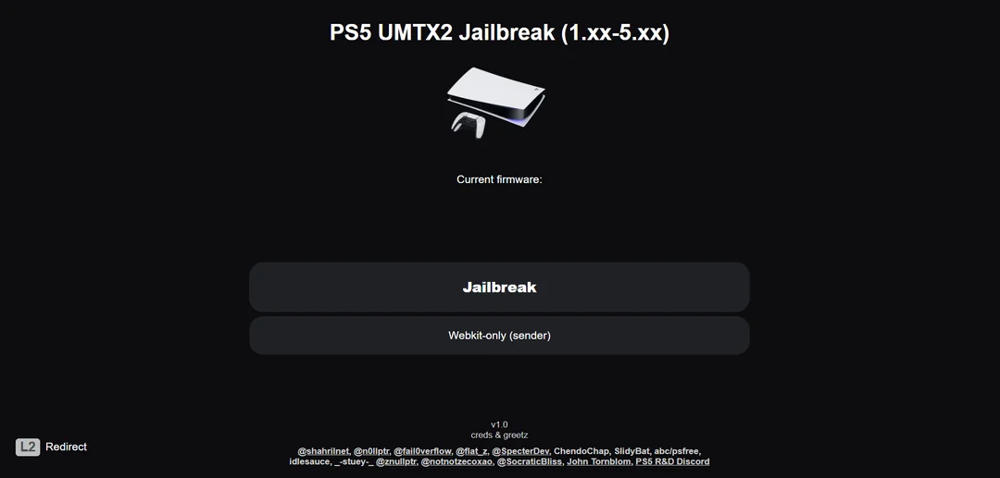
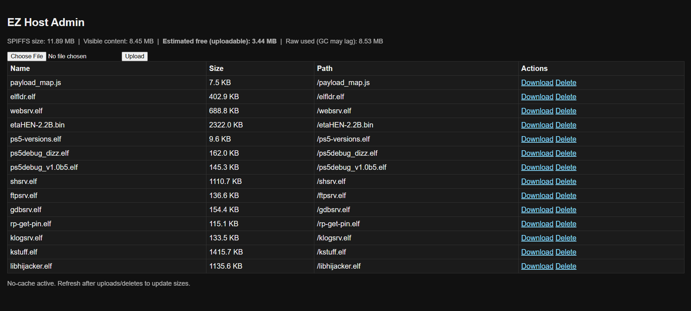

## PS5_EZ_Host by _-stuey-_
Modern UMTX2 ESP32-S3 Web Utility Host (v1.0.3)

  

---

## What Is This?

PS5_EZ_Host is a self-contained, no-fuss platform for PlayStation 5 firmware 1.xx–5.xx, built on the UMTX2 WebKit exploit and optimized for ESP32-S3 boards (16MB flash). This host offers:

- Clean two-stage interface (launch → payloads) based on idlesauce UMTX2  
- Built-in file manager (`/admin.html`) for hot-swapping `.bin` / `.elf` payloads  
- SPIFFS-based hosting — no SD card required  
- Gzip-capable payload support  
- Auto-flashing via `auto_flash.exe` (no Arduino or Python required) — just plug in your board, and this exe will detect your board, COM port, and flash it for you  
- Compatible with any 16MB ESP32-S3 board using CP210x USB

---

## Flashing Instructions

1. Plug your ESP32-S3 board into a USB port  
   *(CP210x USB UART recommended — see driver link below)*

2. Double-click `auto_flash.exe`

3. Let it flash all four images:
   - Bootloader
   - Partition Table
   - Firmware
   - SPIFFS

---

# PS5_EZ_Host

ESP32-S3 based self-hosted web utility platform for PlayStation 5 browser tools.

  

## Overview
PS5_EZ_Host runs entirely from an ESP32-S3 board, serving a lightweight HTML/JS interface to the PS5 web browser.  
It provides a central place to host and launch browser-based tools, with an integrated admin page for managing files stored on the device.

## Features
- Clean, responsive browser UI
- Integrated file manager for adding/removing web files
- Works completely offline once set up
- Supports `.bin.gz` and `.elf` payload formats

## Build Instructions (Developers Only)
If you want to build from source rather than use the provided release package:

1. Install [Arduino IDE](https://www.arduino.cc/en/software) and ESP32 board support.
2. Open `WIP.ino` in Arduino IDE.
3. Select your ESP32-S3 board and matching partition scheme.
4. Upload the sketch to the board.
5. Flash the SPIFFS image containing the `data/` folder.

## Downloads
Compiled binaries (`firmware.bin` and `spiffs.bin`) are available in the **[Releases](../../releases)** section.  
Source code is provided so users can review and compile themselves.

## License
This project is licensed under the [MIT License](LICENSE).

