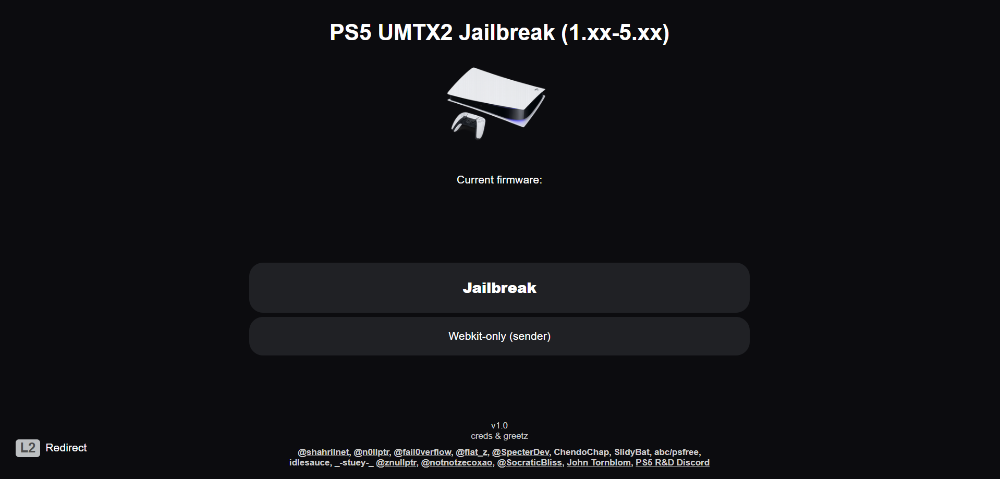
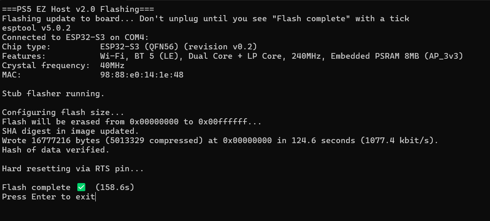

# PS5\_EZ\_Host by *-stuey-*

**ESP32-S3 N16/R8 host with UMTX2 and Admin File Manager for PS5 (v2.0)**

  

Get the latest build in **[Releases](../../releases)**.

---

## What is it?

**PS5\_EZ\_Host** is a self-contained, offline host for PlayStation 5 firmwares **1.xx–5.xx**, built on **UMTX2** and tuned for ESP32-S3 (16 MB).

**Why 2.0?**
This is a **complete rewrite** focused on speed and reliability.

* **\~38× faster** payload uploads over Wi-Fi (e.g., 1.4 MB in \~22 s on the same hardware).
* **User Guide redirect** supported (see notes below).
* **One-click flashing** via `Auto_flash.exe`—no NodeMCU.

---

## Highlights

* Clean two-stage UMTX2 UI (launch → payloads).
* **Admin Manager** at `http://10.1.1.1/admin`
  — upload, download, delete; **slim progress bar** during uploads.
* Ships with **14 payloads**, including **kstuff v1.6 (DLC fix)**.
* **\~5.5 MB free** out of the box; gzip payloads to free more space.
* **bypervisor** included **only for 1.xx–2.xx** (others may delete).
* Works fully offline; device advertises as **PS5\_EZ\_Host**.

  

---

## Quick Start (Flashing)

1. **Download** the latest release (includes `Auto_flash.exe` and image).
2. **Connect** your ESP32-S3 N16/R8 by USB.
3. **Run** `Auto_flash.exe`. It auto-detects the COM port and flashes automatically.

---

## Connect the PS5 (band setting required)

On the PS5:

1. Go to **Settings → Network → Settings → Set Up Internet Connection**.
2. Find **PS5\_EZ\_Host**. **Press Options** on the controller and choose **2.4 GHz**.

   > If you skip this, the SSID may **not appear**.
3. Connect (open network, no password).

Now:

* Open **`http://10.1.1.1`** on the PS5 to use the host.
* Visit **`http://10.1.1.1/admin`** from a **PC** on the same Wi-Fi to manage payloads.

---

## Using the PS5 **User Guide** (optional)

* Open **Settings → User Guide** to launch the host directly.
* You will see a **certificate warning** the first time—**accept** it.
* The User Guide browser is slower; after jailbreaking, installing a **browser PKG** is recommended for faster navigation.
* You can always use **`http://10.1.1.1`** directly.

---

## Admin Manager

Open **`http://10.1.1.1/admin`** on a **PC**:

* **Choose File → Upload** a payload (**`.bin`/`.elf`** or gzipped variants).
  The **progress bar** shows transfer progress; the page refreshes after completion.
* **Download/Delete** to manage files.

  

---

## Editing `payload_map.js`

Use this to rename buttons, change descriptions, add/remove entries, or change order:

1. In **`/admin`**, **Download** `payload_map.js`.
2. Edit in a text editor. For each entry:

   * `displayTitle` — button label on the main screen.
   * `description`, `author`, `version` — text shown in details.
   * `fileName` — **just the filename** you uploaded (e.g., `kstuff.elf`, `etaHEN-2.2B.bin`).

     > No path editing is required; upload the file and set its **filename** here.
3. **Upload** the modified `payload_map.js` back via **`/admin`** and refresh **`http://10.1.1.1`**.
   *On PS5, press **◯** or refresh the page via the refresh button.*

> Tip: To save space, upload **gzip** versions (`.bin.gz`/`.elf.gz`) where available.

---

## Recommended workflow

* First use: reach the host via **User Guide** (accept certificate) or **`http://10.1.1.1`**.
* After jailbreak: use a **browser PKG** for faster load times.
* Remove payloads you don’t use. If you’re **not** on **1.xx–2.xx**, you can delete **bypervisor**.

---

## Compatibility

* **Hardware:** ESP32-S3, 16 MB flash (N16/R8).
* **PS5 firmware:** **1.xx–5.xx**.
* **Network:** offline AP, open.

---

## Changelog (2.0)

* Complete rewrite with major stability fixes.
* \~38× faster payload uploads over Wi-Fi.
* User Guide redirect support (with cert prompt).
* New upload progress bar in Admin.
* Curated payload set (14), including **kstuff v1.6 (DLC fix)**.

---

## Credits

* idlesauce, **mautz-kernel**, **stooged**, **EchoStretch**

---

## License

MIT — see [LICENSE](LICENSE).

---
